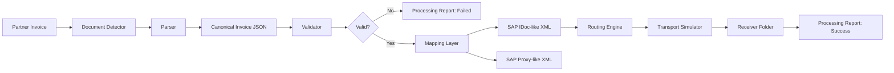

# Architecture

## High-level flow

## Components

### Document Detector

Inspects payload markers such as XML namespaces, EDIFACT segments, X12 transaction sets or SAP IDoc segments.

### Parser

Maps each source format into the same canonical invoice model.

### Canonical Invoice

A neutral internal representation used between parsing and target mapping.

### Validator

Checks mandatory business fields and simple data quality rules.

### Mapper

Transforms the canonical model into SAP target structures.

### Router

Chooses the simulated receiver/protocol based on customer, supplier and currency.

### Transport Simulator

Writes the generated payload into a receiver/protocol-specific output folder.

### Dashboard

Shows the last processing report, canonical invoice, route decision, errors and generated SAP payload.
